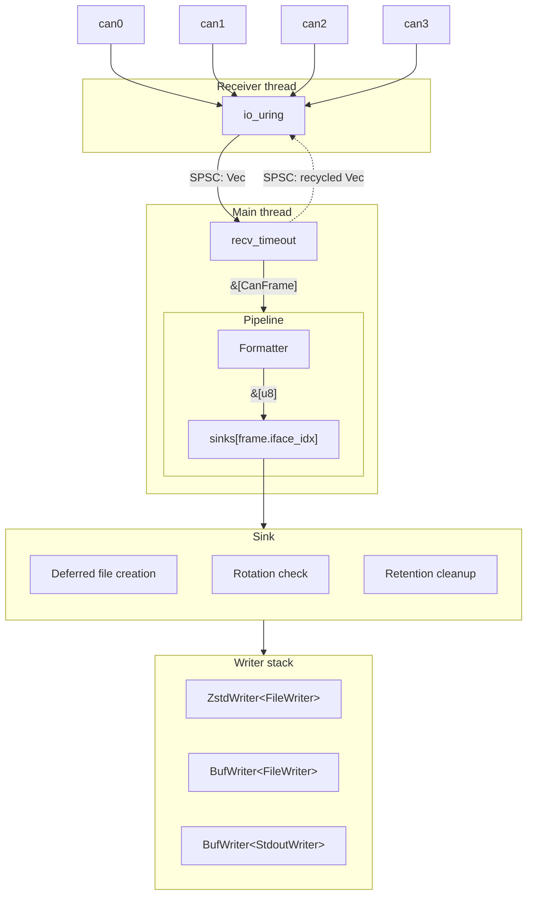
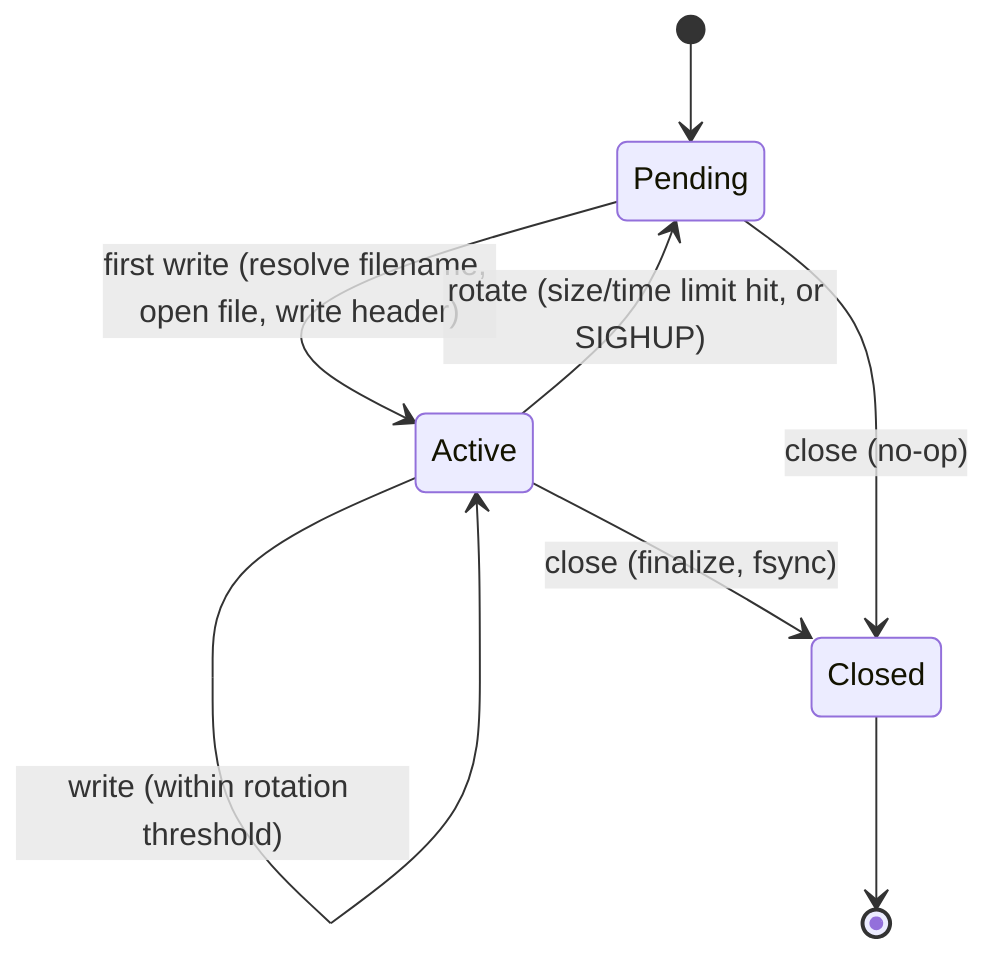

# candumpr architecture

Status: **PROPOSAL**

# Scope

This document proposes the core data pipeline for candumpr.

# Goals

The baseline implementation that this proposal intends to improve upon is using one can-utils
`candump` process to do blocking receives for each logged network. On low-spec systems, this results
in a noticeable performance impact, which would be manageable, except that the logging on those
systems is ancillary to the application software those systems are primarily responsible for.

Paraphrasing the goals from [01-goals.md](/docs/design/candumpr/01-goals.md), the overall goal for
candumpr is to reduce the system performance impact of using candump in this manner.

# Proposed architecture

The proposal is to use one shared receive thread that uses io_uring multishot to batch receives
across multiple networks. This reduces the number of syscalls per frame to less than one-per frame.
This reduces the overall context switching cost when logging multiple networks.

As I intend to support systems with slow disks (`write()` syscalls that sporadically block for
multiple seconds), the receive thread is decoupled from the format + write thread, which also
services multiple networks. See: <https://github.com/linux-can/can-utils/issues/381> for additional
background.

Assume a worst-case throughput of 8x 500kbaud networks at 100% busload. That's 500KB/s of raw data,
plus some inflationary factor from the formatter (formatting as ASCII adds a constant scalar to the
throughput). This is well within the formatting, compression, and write capabilities of a single
thread.

## High-level data flow



## Component hierarchy

The pipeline has four layers:

| Layer     | Responsibility                                                                                                                                                                                                                                                             |
| --------- | -------------------------------------------------------------------------------------------------------------------------------------------------------------------------------------------------------------------------------------------------------------------------- |
| Main loop | Recv batches from SPSC channel, call `pipeline.write_batch()`, recycle the batch Vec back to the receiver, forward SIGHUP via `pipeline.rotate()`, call `pipeline.flush()` on idle timeout, `pipeline.close()` on STOP                                                     |
| Pipeline  | Owns one Formatter and a `Vec<Sink>` whose length is either 1 (single-file mode) or the number of interfaces (per-interface mode). Formats each frame into a per-Sink scratch buffer, then writes each non-empty buffer to its Sink once per batch.                        |
| Sink      | Three-state machine (Pending/Active/Closed). Owns filename template, rotation config, retention config, header blob, file index. Handles deferred file creation, rotation decisions, retention cleanup. Constructs the Writer stack on activation. Terminal after `close`. |
| Writers   | Composable, each wraps a generic inner Writer. Trait has `write`, `flush`, and `finish`. Leaf implementations are FileWriter and StdoutWriter.                                                                                                                             |

## Receiver detail

There are many ways in which a receiver thread or threads could be built using Linux syscalls:

* candump-style blocking `read()` in a dedicated thread per interface
* `epoll()` and non-blocking `read()` to wake up and receive frames one-by-one when they arrive
* `epoll()` and non-blocking `recvmmsg()` to receive as many ready frames as possible on any wakeup
* `io_uring` singleshot - each SQE represents one `read()` - after reading from a socket, the `Recv`
  opcode is resubmitted.
* `io_uring` multishot - one SQE submitted for each socket with the `RecvMsgMulti` opcode and
  `submit_with_args(batch=4, timeout=100ms)` to wait until `batch` frames are ready to receive
  together from any interfaces.

The multishot io_uring receiver strategy results in _significantly_ fewer syscalls and context
switches per ready CAN frame, resulting in overall better system performance, and degradation under
contention.

The batch size could be significantly increased when logging to a file, but when logging to
`stdout`, we should use a lower batch size (like 4) to facilitate watching a live log. We cannot
infinitely increase the batch size - there's a tipping point at which if we increase it too far, we
run the risk of filling up the recvbuf. A batch size of 32 or 64 seems like a reasonable upper
limit.

## Batching CanFrames

Sending the `CanFrame`s in batches over the channel allows the writer to format and write the whole
batch at once, which is a nice property. Using a second channel to send emptied `Vec`s back to the
receiver allows us to re-use the allocations without repeated high frequency alloc/free cycles.

* At startup, a small pool of pre-allocated Vecs is pushed into the recycle channel.
* The receiver pulls a Vec from the recycle channel via `try_recv` and falls back to a fresh
  allocation if the pool is empty.
* The main loop receives a batch, hands it to the Pipeline, clears the Vec and `try_send`s it back
  to the recycle channel. If the recycle channel is full, the Vec is dropped.

## Main loop detail

The main loop runs on the main thread. It receives batches from the SPSC channel and hands them to
the Pipeline, relying on a byte threshold inside the Sink to trigger flushes during normal
operation:

```rust
send_address_claims(&claim_ifaces)

loop {
    match full_rx.recv_timeout(100ms) {
        Ok(batch) => {
            pipeline.write_batch(&batch)
            recycle(batch)
        }
        Err(Timeout) => pipeline.flush()
    }
    if SIGHUP.swap(false) {
        pipeline.rotate()
        send_address_claims(&claim_ifaces)
    }
    send_address_claims(&pipeline.take_rotated())
    if STOP.load() { pipeline.close(); break }
}
```

Each batch represents one CQE drain from the receiver, so the main loop does not need to perform its
own draining: a batch already coalesces frames that were ready together.

Flushing is driven by a byte threshold inside the Sink, not by the batching loop. Each `write_batch`
call tracks bytes written to each Sink since the last flush. When the threshold is crossed, the Sink
calls `writer.flush()` between writes (never mid-write). This produces predictable flush granularity
regardless of traffic burstiness. `flush()` is unconditional at each layer of the Writer stack: the
Sink is the single place that decides when to call it.

The 100ms `recv_timeout` is a safety net for idle periods: when no batches arrive, the timeout fires
and `pipeline.flush()` pushes out whatever is buffered. Under normal load this timeout rarely fires.

Signal handling is cooperative: the main loop checks atomic flags between iterations. SIGHUP
triggers rotation. SIGTERM/SIGINT trigger shutdown. Neither is latency-sensitive since finishing the
current drain batch before acting is acceptable.

## Address claim requests

The main loop optionally sends J1939 address claim PGN requests as a fire-and-forget broadcast to
solicit address claim responses from all ECUs on the network. The purpose is to ensure each log file
contains the network's address-to-NAME mapping near its beginning, making logs self-contained for
offline analysis.

### Triggers

* **Startup**: after the receiver thread is running, before entering the main loop. Responses are
  among the first frames received, triggering deferred file creation for the initial log file.
* **SIGHUP rotation**: after `pipeline.rotate()` returns, the main loop sends address claims for all
  configured interfaces.
* **Size/duration rotation**: rotation triggered internally by the Sink during `write_frame()`. The
  Pipeline tracks which interfaces rotated, and the main loop drains this set via
  `pipeline.take_rotated()` after each drain batch, sending address claims for those interfaces.

## Pipeline detail

The Pipeline owns a single Formatter, a `Vec<Sink>`, and one scratch format buffer per Sink.

When the output path template contains `{interface}`, `sinks.len() == n_interfaces` and frames are
dispatched by `frame.iface_idx`. Otherwise, `sinks.len() == 1`, all traffic is interleaved into that
single Sink, and `frame.iface_idx` is used only by the Formatter (for the interface-name column in
formats that need it), not for dispatch.

On `write_batch(&[CanFrame])`:

1. Clear each Sink's scratch buffer.
2. For each frame in the batch, format it into the buffer of its target Sink: `sinks[iface_idx]` in
   per-interface mode, or `sinks[0]` in single-file mode.
3. For each Sink with a non-empty buffer, call `sink.write(buf)` exactly once.

This collapses every frame in the batch destined for a given Sink into a single `sink.write` call,
preserving the invariant that each `sink.write` carries whole formatted frames. In single-sink mode
that is one write per batch; in per-interface mode, one write per (interface, batch) pair.

On `flush()`, `rotate()`, and `close()`: forward to each Sink.

On `take_rotated()`: return and clear the set of interface indices whose Sinks rotated during
`write_batch()`. This allows the main loop to send address claim requests for interfaces that
rotated due to size or duration limits.

## Formatter detail

The Formatter converts a CanFrame into a byte array to be written. It is stateless (or nearly so)
and is owned by the Pipeline, not by individual Sinks. All configuration (interface names, timestamp
mode, format) is provided at construction time.

The Formatter trait has two methods:

* `format(&self, frame: &CanFrame, buf: &mut Vec<u8>)` -- append the formatted frame to the buffer.
  The buffer may contain multiple frames. A frame is never split across multiple writes.
* `header(&self) -> Option<&[u8]>` -- return the file header for formats that need one (e.g. PCAP),
  or None for formats that do not (e.g. candump, ASC). The Pipeline provides this header blob to
  each Sink at construction time, and the Sink writes it when opening a new file.

Output formats: can-utils candump (file and console variants), Vector ASC, PCAP.

## Sink detail

The Sink is a three-state machine that manages one output destination.



### Pending state

Holds all configuration needed to open a new file:

* Filename template, interface name, format extension
* Current file index (monotonically increasing, persistent across restarts via directory scan)
* Rotation config (size limit or duration limit, or none)
* Retention config (size limit, or none)
* Compression config (on/off)
* Flush byte threshold (drives how often the Sink calls `writer.flush()` during normal writes)
* Header blob from the Formatter

### Active state

Adds the live output state:

* The Writer stack (constructed based on compression and output config)
* Output bytes written to the current file since it was opened (for size-based rotation tracking).
  For compressed output this is the post-compression size, so the user's size limit matches the
  on-disk file size regardless of compression ratio. The FileWriter leaf owns this counter and the
  Sink queries it after each write.
* File open instant from the monotonic clock (for duration-based rotation tracking)
* Current filename (for logging rotation events to stderr)

### Closed state

Terminal state. Reached by `close`, which calls `writer.finish()` if the Sink was Active (flushing
buffers, writing the zstd frame epilogue if compressed, fsyncing the file) or no-ops if the Sink was
Pending. A Closed Sink does not accept further writes: subsequent `write` calls return an error
rather than re-opening the file. `flush`, `rotate`, and `close` on an already-Closed Sink are
no-ops.

### Deferred file creation

Files are not created until the first frame arrives. On the first `write()` call:

1. Capture the frame's timestamp for filename resolution
2. Resolve the filename template (interface name, index, timestamp, extension)
3. Create parent directories as needed
4. Open the file
5. Construct the Writer stack based on config
6. Write the header blob (if any)
7. Transition to Active

This avoids creating empty files for interfaces that never see traffic, and the filename timestamp
reflects when traffic actually started.

### Rotation

Rotation is triggered by:

* **Size**: output bytes written to the current file exceeds the configured limit (post-compression
  when compression is enabled)
* **Duration**: monotonic time since file open exceeds the configured limit
* **SIGHUP**: forwarded from the main loop via `pipeline.rotate()`

Size and duration are mutually exclusive per the configuration design.

The rotation sequence:

1. Call `writer.finish()` (flushes and finalizes the Writer stack)
2. Run retention cleanup
3. Increment the file index
4. Transition to Pending

The next `write()` call triggers deferred file creation with the new index and new frame timestamp.

### Retention cleanup

Retention runs synchronously after each rotation. The Sink scans the output directory for files
matching its filename pattern (same interface, same extension) and deletes the oldest files (by
index, lowest first) until the total size is under the configured limit.

Retention is size-based only. Age-based retention is not supported because the system clock may be
unreliable on target systems (clocks set to far-future dates, RTC unset at boot, clock jumps). The
file index provides reliable ordering regardless of clock state.

Retention is per-interface. Each Sink independently manages its own files. There is no global
aggregate retention policy.

When retention is not configured, the cleanup step is a no-op.

## Writer detail

Writers are composable. Each Writer wraps an inner Writer, forming a stack. The trait:

```
Writer:
    write(&mut self, buf: &[u8]) -> Result<()>
    flush(&mut self) -> Result<()>
    finish(&mut self) -> Result<()>
```

* `write` -- push bytes through to the inner Writer (possibly buffering or transforming)
* `flush` -- flush internal buffers so data is recoverable up to this point
* `finish` -- finalize the stream (called on rotation and shutdown only)

### Writer implementations

**FileWriter** (leaf): writes to a file descriptor.

* `write`: `fd.write(buf)`
* `flush`: no-op (data is in the kernel page cache)
* `finish`: `fsync`

**StdoutWriter** (leaf): writes to stdout, flushes eagerly for live viewing.

* `write`: `stdout.write(buf)` then `stdout.flush()`
* `flush`: no-op (already flushed on every write)
* `finish`: no-op

**BufWriter\<W: Writer\>**: buffers small writes into larger ones.

* `write`: buffer bytes, flush to inner Writer when buffer is full
* `flush`: flush buffer to inner Writer, call `inner.flush()`
* `finish`: flush buffer to inner Writer, call `inner.finish()`

**ZstdWriter\<W: Writer\>**: compresses data with zstd streaming compression.

* `write`: feed bytes into the zstd encoder
* `flush`: call `ZSTD_e_flush` to emit a complete compressed block to the inner Writer, then call
  `inner.flush()`. The Sink's flush byte threshold gates how often this runs during normal writes,
  so emitting too-small blocks is already avoided at that layer.
* `finish`: call `ZSTD_e_end` to write the zstd frame epilogue, making the file a complete and
  independently decompressable zstd stream. Then call `inner.finish()`.

### Writer stacks by output mode

| Mode                 | Stack                      |
| -------------------- | -------------------------- |
| File, uncompressed   | BufWriter\<FileWriter\>    |
| File, compressed     | ZstdWriter\<FileWriter\>   |
| Stdout, uncompressed | BufWriter\<StdoutWriter\>  |
| Stdout, compressed   | ZstdWriter\<StdoutWriter\> |

No BufWriter wraps the ZstdWriter because the zstd encoder already batches output into block-sized
chunks. The BufWriter is only needed when many small formatted frames (uncompressed) need to be
batched into fewer `write()` syscalls.

### Flush behavior summary

Both "Sink byte threshold crossed during write" and "idle-timeout `pipeline.flush()`" ultimately
call `writer.flush()` with the same semantics. The Sink is the only place that decides when to call
`flush`; everything below it responds unconditionally.

| Event                           | ZstdWriter            | BufWriter             | FileWriter | StdoutWriter          |
| ------------------------------- | --------------------- | --------------------- | ---------- | --------------------- |
| `flush` (byte threshold / idle) | ZSTD_e_flush          | Flush buffer to inner | No-op      | No-op (already eager) |
| `finish` (rotation / shutdown)  | ZSTD_e_end (epilogue) | Flush buffer to inner | fsync      | No-op                 |

## Compression detail

There are three approaches to streaming zstd compression:

1. **Independent concatenated frames** - periodically call `ZSTD_e_flush` on the encoder to emit
   complete compressed blocks, and `ZSTD_e_end` on rotation/close to finalize the stream. Output is
   decompressable with `zstd -d`. With large-ish blocks (tuned via the flush byte threshold), the
   compression ratio should be good enough that the simplicity of this approach wins over the
   complexity of managing training dictionaries in a production context.

2. **Independent concatenated frames with a pre-trained dictionary** - train a dictionary on CAN
   data to improve compression of small blocks. Output is decompressable with `zstd -d -D can.dict`.
   It might be best to train a dictionary specific to each format. This requires maintaining and
   shipping pre-trained dictionaries, and making them available to engineers troubleshooting CAN
   traffic. A configuration option to provide your own zstd dictionary would offload the dictionary
   training burden onto the consumer.

3. **Prefix-linked frames** - persist the compressor state from previous frames when compressing the
   next. Best compression ratio, but output is **not** decompressable with `zstd -d`. This would
   require a custom decompressor, which eliminates this option from consideration.

**My proposal is approach 1.** It is the simplest, produces files decompressable with standard
tooling, and the compression ratio is expected to be sufficient given the flush byte threshold can
be tuned to produce reasonably large blocks. Dictionary support (approach 2) is a potential future
enhancement that does not affect the architecture.

Each `flush` emits a decompressable block. Each `finish` writes a complete zstd frame epilogue.
Output files are decompressable with `zstd -d`.

Since the Formatter provides whole frames to the encoder, and flushes happen between frames (never
mid-frame), compressed blocks always contain complete formatted frames. No partial frame is ever
split across block boundaries.

A fresh zstd encoder is created for each new file. Encoder state is not carried across rotations.
Each file is independently decompressable.
